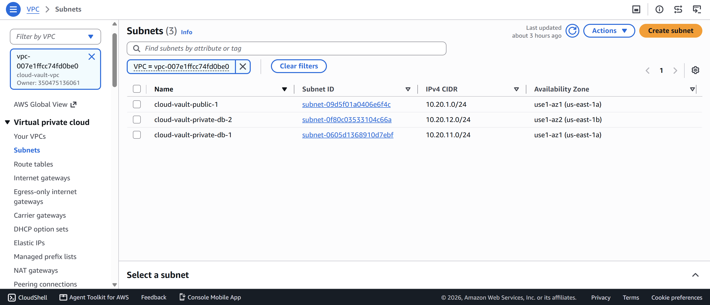
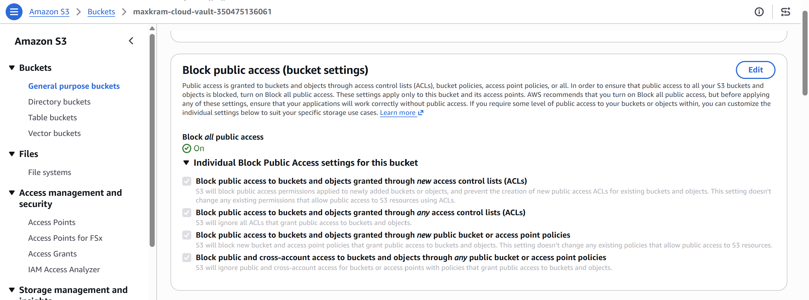
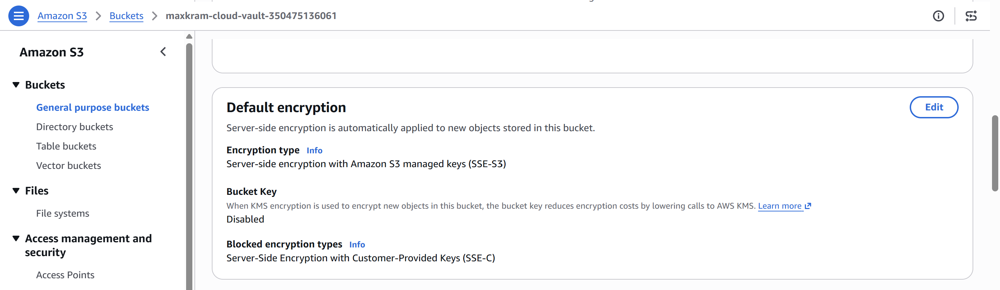
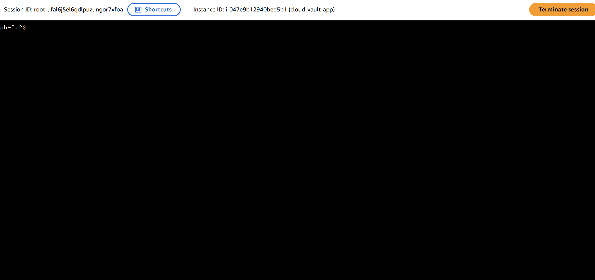
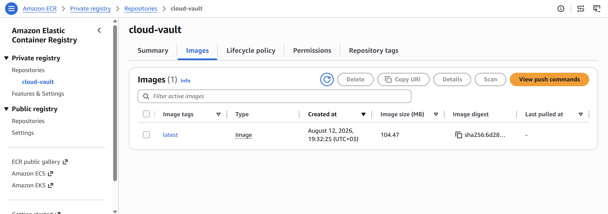
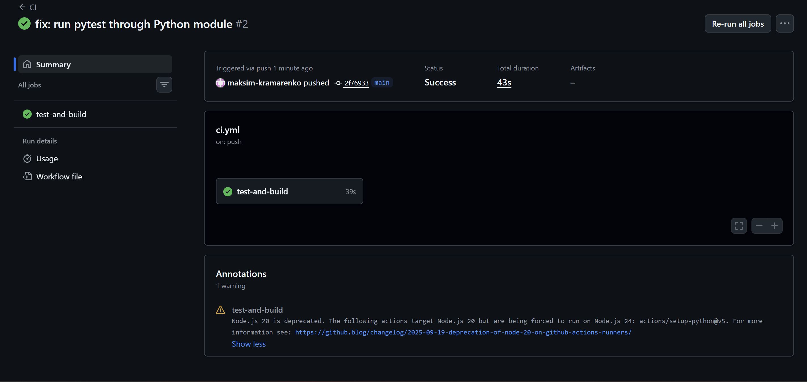
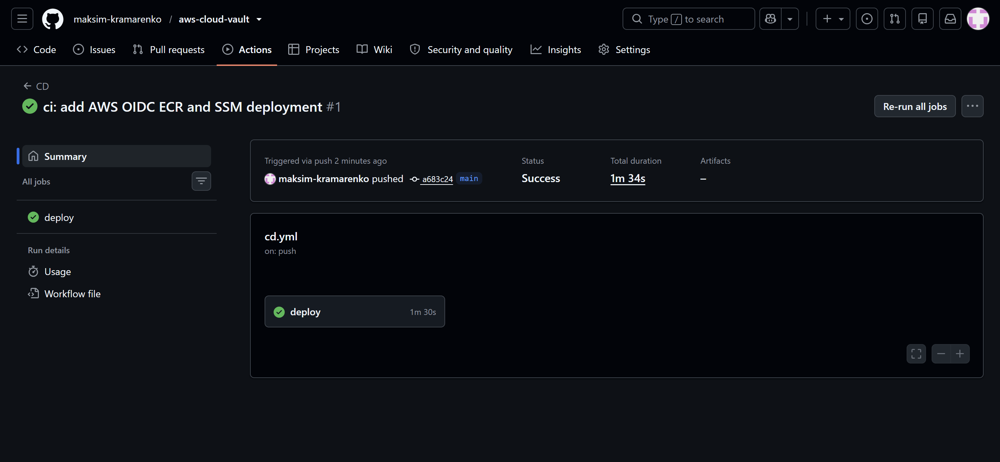
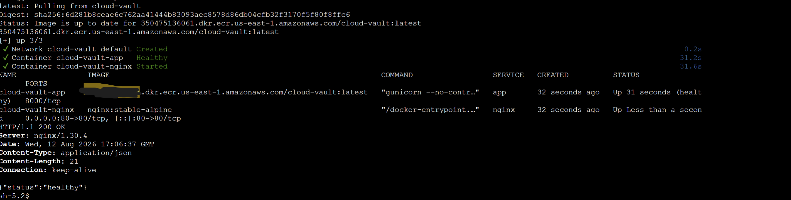
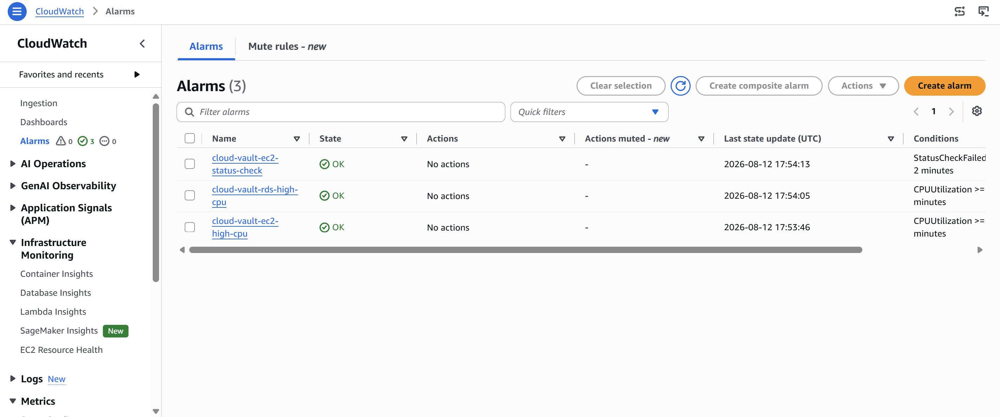

# AWS Cloud Vault

A production-style file storage application deployed on AWS with Docker, PostgreSQL, Amazon S3, automated CI/CD, IAM-based access, and CloudWatch monitoring.

The project demonstrates a complete DevOps workflow:

**GitHub → GitHub Actions → AWS OIDC → Amazon ECR → AWS Systems Manager → EC2**

The application runs behind Nginx on EC2, stores file metadata in a private Amazon RDS PostgreSQL database, and stores uploaded objects in a private Amazon S3 bucket.

---

## Architecture

```text
                        ┌──────────────────────┐
                        │       GitHub         │
                        │   Source Repository  │
                        └──────────┬───────────┘
                                   │
                                   │ push to main
                                   ▼
                        ┌──────────────────────┐
                        │   GitHub Actions     │
                        │     CI / CD          │
                        └──────────┬───────────┘
                                   │
                              AWS OIDC
                                   │
                                   ▼
                        ┌──────────────────────┐
                        │    Amazon ECR        │
                        │   Docker Images      │
                        └──────────┬───────────┘
                                   │
                              SSM Deploy
                                   │
                                   ▼
Internet
   │
   │ HTTP :80
   ▼
┌─────────────────────────────────────────────────────┐
│                     AWS VPC                         │
│                  10.20.0.0/16                      │
│                                                     │
│  Public Subnet                                      │
│  10.20.1.0/24                                       │
│                                                     │
│      ┌───────────────────────────────────────┐      │
│      │                EC2                    │      │
│      │                                       │      │
│      │   Docker Compose                      │      │
│      │                                       │      │
│      │   ┌──────────┐     ┌──────────────┐  │      │
│      │   │  Nginx   │ ──▶ │ Flask        │  │      │
│      │   │   :80    │     │ Gunicorn     │  │      │
│      │   └──────────┘     │ :8000        │  │      │
│      │                    └──────┬───────┘  │      │
│      └───────────────────────────┼──────────┘      │
│                                  │                  │
│                    ┌─────────────┴────────────┐     │
│                    │                          │     │
│                    ▼                          ▼     │
│            Amazon RDS                    Amazon S3 │
│            PostgreSQL                    File Data │
│            Private                       Private   │
│                                                     │
│  Private DB Subnet 1        Private DB Subnet 2    │
│  10.20.11.0/24              10.20.12.0/24          │
│  us-east-1a                  us-east-1b              │
└─────────────────────────────────────────────────────┘
```

---

## Project Goals

The goal of this project is to demonstrate practical DevOps skills using a realistic cloud deployment instead of running every component on a single virtual machine.

The project includes:

* Linux server administration
* AWS networking
* Docker and Docker Compose
* Nginx reverse proxy
* Flask + Gunicorn
* PostgreSQL
* Amazon S3
* Amazon RDS
* IAM roles and least-privilege permissions
* AWS Systems Manager
* GitHub Actions
* AWS OIDC authentication
* Amazon ECR
* CloudWatch monitoring
* CI/CD automation

---

## Technology Stack

### Application

* Python 3.12
* Flask
* Gunicorn
* SQLAlchemy
* Flask-Migrate / Alembic
* PostgreSQL
* boto3

### Infrastructure

* Amazon EC2
* Amazon EBS
* Amazon RDS PostgreSQL
* Amazon S3
* Amazon ECR
* AWS IAM
* AWS Systems Manager
* AWS Systems Manager Parameter Store
* Amazon CloudWatch
* Amazon VPC
* Internet Gateway
* Security Groups
* AWS Budgets

### DevOps

* Docker
* Docker Compose
* Nginx
* Git
* GitHub
* GitHub Actions
* AWS OIDC
* SSM Run Command

---

## AWS Network Design

The application uses a custom VPC:

```text
VPC
10.20.0.0/16
```

Subnets:

| Subnet                     | CIDR            | Availability Zone | Purpose |
| -------------------------- | --------------- | ----------------- | ------- |
| `cloud-vault-public-1`     | `10.20.1.0/24`  | `us-east-1a`      | EC2     |
| `cloud-vault-private-db-1` | `10.20.11.0/24` | `us-east-1a`      | RDS     |
| `cloud-vault-private-db-2` | `10.20.12.0/24` | `us-east-1b`      | RDS     |

The public subnet has a route to an Internet Gateway:

```text
0.0.0.0/0 → Internet Gateway
```

The RDS subnets remain private and do not expose the database directly to the Internet.



---

## Security Design

Security was treated as a core part of the architecture.

### EC2 Security Group

Inbound:

```text
TCP 80
Source: 0.0.0.0/0
```

SSH port `22` is not part of the normal deployment or administration workflow.

The instance is primarily managed through **AWS Systems Manager Session Manager**.

### RDS Security Group

PostgreSQL access is restricted to the EC2 application Security Group:

```text
TCP 5432
Source: cloud-vault-app-sg
```

The database is configured with:

```text
Publicly Accessible: No
Storage Encryption: Enabled
```

### S3

The S3 bucket is private.

All four S3 Block Public Access settings are enabled.



Default server-side encryption uses Amazon S3 managed keys:

```text
SSE-S3 / AES-256
```



Uploaded file names are not used directly as object keys.

Objects are stored with generated UUID-based keys such as:

```text
uploads/9d657ace-145f-472a-9a91-e525e6a09712.txt
```

This avoids collisions and prevents direct trust in user-provided filenames.

---

## IAM and Instance Access

The EC2 instance uses an IAM instance profile:

```text
cloud-vault-ec2-profile
```

The associated role provides access to:

* Systems Manager
* the Cloud Vault S3 bucket
* Cloud Vault Parameter Store parameters
* read-only access to Amazon ECR

No long-lived AWS credentials are stored on the EC2 instance.

Interactive administration is performed through:

```text
EC2
→ Connect
→ SSM Session Manager
```



---

## Configuration and Secrets

Application configuration is stored in AWS Systems Manager Parameter Store.

Parameters:

```text
/cloud-vault/prod/db-host
/cloud-vault/prod/db-name
/cloud-vault/prod/db-user
/cloud-vault/prod/db-password
/cloud-vault/prod/s3-bucket
/cloud-vault/prod/aws-region
```

The database password is stored as:

```text
SecureString
```

Secrets are not committed to Git.

The application receives a production database connection string generated from Parameter Store values.

---

## Docker

The application uses a multi-stage Docker build.

The final application container runs as a non-root user.

```text
UID: 10001
```

Production containers:

```text
cloud-vault-app
cloud-vault-nginx
```

Nginx listens on:

```text
80
```

Gunicorn listens internally on:

```text
8000
```

The application container includes a Docker health check:

```text
GET /health
```

Example:

```text
HTTP/1.1 200 OK

{"status":"healthy"}
```

---

## Local Development

Local development uses Docker Compose with PostgreSQL.

```bash
docker compose -f compose.local.yaml up -d
```

Run tests:

```bash
python -m pytest -q
```

Build the production image:

```bash
docker build -t aws-cloud-vault:prod .
```

---

## Production Deployment

The production Compose configuration contains only:

```text
Nginx
Flask / Gunicorn
```

PostgreSQL is not deployed inside Docker in production.

Instead:

```text
Local Development
Docker PostgreSQL

Production
Amazon RDS PostgreSQL
```

This separates the application and database lifecycle and demonstrates a more realistic cloud architecture.

---

## Database Migrations

Database migrations are managed with Alembic / Flask-Migrate.

Production migration example:

```bash
docker compose -f compose.prod.yaml exec -T app \
  flask --app 'app:create_app()' db upgrade
```

The initial migration creates the `files` table.

The production database runs in Amazon RDS inside private subnets.

---

## File Upload Flow

When a file is uploaded:

```text
Client
  │
  ▼
Nginx
  │
  ▼
Flask
  │
  ├── Upload object → Amazon S3
  │
  └── Save metadata → Amazon RDS PostgreSQL
```

Example successful upload:

```text
HTTP/1.1 201 CREATED
```

Metadata stored in PostgreSQL includes:

* original filename
* generated S3 object key
* file size
* content type
* creation timestamp

The application supports:

* file upload
* file listing
* file download
* file deletion

---

## Amazon ECR

Production Docker images are stored in a private Amazon ECR repository:

```text
cloud-vault
```

Images are tagged using both:

```text
latest
```

and the Git commit SHA:

```text
<git-sha>
```

Using the Git SHA allows a deployment to identify exactly which application revision is running.



---

## CI Pipeline

GitHub Actions runs CI on:

```text
push → main
pull request → main
```

CI performs:

```text
Checkout
   ↓
Python 3.12
   ↓
Install dependencies
   ↓
Run pytest
   ↓
Flask import check
   ↓
Docker build
```

The pipeline verifies that the application can be tested and built before deployment.



---

## CD Pipeline

Production deployment is fully automated with GitHub Actions.

```text
git push
   │
   ▼
GitHub Actions
   │
   ├── Run tests
   │
   ▼
AWS OIDC Authentication
   │
   ▼
Build Docker Image
   │
   ▼
Push Image to Amazon ECR
   │
   ▼
SSM Run Command
   │
   ▼
EC2
   │
   ├── Pull exact Git SHA image
   ├── Docker Compose up
   ├── Run database migrations
   └── Health check
```



---

## GitHub Actions and AWS OIDC

GitHub Actions authenticates to AWS using OpenID Connect.

No AWS access key or secret access key is stored in GitHub.

The GitHub Actions IAM role is restricted to the repository and the `main` branch.

The deployment role can:

* authenticate with ECR
* push images to the Cloud Vault ECR repository
* execute SSM Run Command on the Cloud Vault EC2 instance
* read SSM command execution status

This provides short-lived AWS credentials for each workflow run.

---

## Deployment Through AWS Systems Manager

GitHub Actions does not use SSH for deployment.

Deployment commands are executed through:

```text
AWS Systems Manager Run Command
```

The EC2 instance:

1. receives an SSM command
2. updates the application repository
3. authenticates with ECR
4. pulls the new Docker image
5. starts containers with Docker Compose
6. runs database migrations
7. checks `/health`

Example successful production deployment:



---

## Monitoring

CloudWatch alarms monitor the main infrastructure components.

Configured alarms:

```text
cloud-vault-ec2-status-check
cloud-vault-ec2-high-cpu
cloud-vault-rds-high-cpu
```

Metrics:

| Resource | Metric              | Threshold |
| -------- | ------------------- | --------- |
| EC2      | `StatusCheckFailed` | >= 1      |
| EC2      | `CPUUtilization`    | >= 80%    |
| RDS      | `CPUUtilization`    | >= 80%    |



The application also exposes:

```text
GET /health
```

for application-level health verification.

---

## Cost Controls

The project was designed to avoid unnecessary AWS costs.

Cost-conscious decisions include:

* small EC2 instance
* small RDS instance
* Single-AZ RDS
* no NAT Gateway
* 8 GiB EC2 root volume
* S3 SSE-S3 encryption
* standard CloudWatch metrics
* AWS Budget configured
* resources can be destroyed after the final demo

A NAT Gateway was intentionally not used because the private RDS subnets do not require outbound Internet connectivity for this architecture.

---

## Repository Structure

```text
aws-cloud-vault/
├── .github/
│   └── workflows/
│       ├── ci.yml
│       └── cd.yml
│
├── app/
│   ├── services/
│   ├── config.py
│   ├── routes.py
│   └── ...
│
├── migrations/
├── nginx/
├── tests/
├── docs/
│   └── images/
│
├── Dockerfile
├── compose.local.yaml
├── compose.prod.yaml
├── requirements.txt
├── requirements-dev.txt
├── .env.example
└── README.md
```

---

## Testing

The project contains automated tests for application functionality and the S3 service layer.

Tests cover areas including:

* health endpoint
* file listing
* upload flow
* download endpoint
* delete endpoint
* S3 upload
* pre-signed download URL generation
* S3 object deletion

Run locally:

```bash
python -m pytest -q
```

CI runs the same test suite automatically for every push and pull request targeting `main`.

---

## Troubleshooting Examples

Several deployment issues were intentionally diagnosed during the project.

### Dockerfile Parse Error

A malformed multi-line Docker `CMD` caused:

```text
unknown instruction: "gunicorn",
```

The Dockerfile was corrected to use valid exec-form syntax:

```dockerfile
CMD ["gunicorn","--no-control-socket","--bind","0.0.0.0:8000","--workers","2","--threads","2","--timeout","30","app:create_app()"]
```

### Missing PostgreSQL Table

The first production request to:

```text
GET /files
```

returned HTTP 500.

Application logs showed:

```text
psycopg.errors.UndefinedTable:
relation "files" does not exist
```

The issue was fixed by running the production database migration:

```bash
flask --app 'app:create_app()' db upgrade
```

After the migration:

```text
GET /files
→ HTTP 200
```

### IAM Parameter Store Permission

An initial `GetParametersByPath` request failed because the IAM policy allowed only:

```text
parameter/cloud-vault/prod/*
```

but not the path resource itself:

```text
parameter/cloud-vault/prod
```

The IAM policy was corrected and access succeeded.

These examples demonstrate application, container, database, and IAM troubleshooting in a real AWS environment.

---

## Production Verification

The final deployment was verified using multiple checks.

### Docker Containers

```text
cloud-vault-app     healthy
cloud-vault-nginx   running
```

### Application Health

```text
GET /health
HTTP 200
```

### Database

```text
GET /files
HTTP 200
```

### Upload

```text
POST /upload
HTTP 201
```

The upload was successfully stored in:

```text
Amazon S3
```

while its metadata was stored in:

```text
Amazon RDS PostgreSQL
```

---

## Demo Flow

A complete demo can be performed as follows:

1. Show the AWS VPC and subnets.
2. Show the private RDS database.
3. Show S3 Block Public Access and encryption.
4. Show the EC2 instance and IAM role.
5. Show SSM Session Manager access.
6. Show Docker containers running on EC2.
7. Upload a test file.
8. Show the object in S3.
9. Show the file metadata through `/files`.
10. Push a small commit to GitHub.
11. Show CI passing.
12. Show CD authenticating through AWS OIDC.
13. Show the new Docker image in ECR.
14. Show the SSM deployment.
15. Verify `/health`.
16. Show CloudWatch alarms in `OK` state.

---

## Key DevOps Concepts Demonstrated

This project demonstrates practical experience with:

* Infrastructure networking
* Public and private subnets
* Security Group references
* Linux server administration
* Containerization
* Reverse proxy configuration
* Managed relational databases
* Object storage
* IAM least privilege
* Secret management
* AWS workload identities
* OIDC federation
* CI/CD pipelines
* Container registries
* Remote deployment without SSH
* Application health checks
* Cloud monitoring
* Production troubleshooting
* Cost-aware AWS architecture

---

## Possible Future Improvements

Possible extensions include:

* HTTPS with ACM and an Application Load Balancer
* Route 53 DNS
* Terraform infrastructure as code
* ECS or EKS deployment
* CloudWatch Logs integration
* SNS alarm notifications
* automated database backup validation
* container vulnerability scanning
* staging and production environments
* blue/green deployments
* automated rollback
* Redis caching
* centralized observability

---

## Security Notes

This repository does not contain:

* AWS access keys
* AWS secret keys
* database passwords
* private SSH keys
* `.env.prod`

Sensitive configuration is provided at runtime using IAM roles and AWS Systems Manager Parameter Store.

---

## Status

**Production deployment completed successfully.**

```text
CI          ✅
CD          ✅
AWS OIDC    ✅
ECR         ✅
EC2         ✅
Docker      ✅
Nginx       ✅
Flask       ✅
RDS         ✅
S3          ✅
SSM         ✅
CloudWatch  ✅
```
